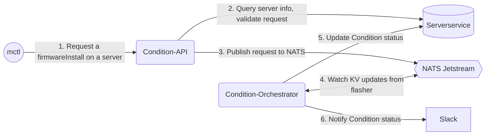

# Condition API and Orchestrator

ConditionOrc provides the [conditions](https://github.com/metal-toolbox/architecture/blob/firmware-install-service/firmware-install-service.md#conditions) construct, to execute exclusive and non-exclusive actions on server hardware.

It does this by,
 - Exposing an API to request actions like `firmwareInstall`, `inventory` on a server.
 - Then validating and publishing the request to the NATS Jetstream, where controllers like [Alloy](https://github.com/metal-toolbox/alloy) and [Flasher](https://github.com/metal-toolbox/flasher) carry out the actual work to fulfill the request.
 - Following the status of the request and notifying using the configured notifier.

Diagram depicts flow of a `firmwareInstall` Condition request

## Development

Checkout the following resources for development and testing,

- Condition request, response payload - [example](./sample/firmwareInstall.md).
- For more information on how this fits all together - [architecture doc](https://github.com/metal-toolbox/architecture/blob/firmware-install-service/firmware-install-service.md).
- For local development and testing with NATS and the controllers - [sandbox](https://github.com/metal-toolbox/sandbox).